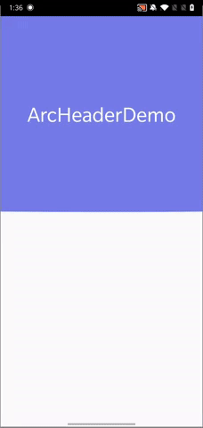

# Hello there 👋

A lot of apps these days have a header at the top with a curved bottom edge, some have a gradient, some are solid and some even animate the curvature with scroll.

With ArcHeader you can also do all of that and make your app look great! Follow along to know about how it works and the customizations available 👇

### Available Types

#### 1. ArcHeader



This is the simpler version where you can set solid background color.

```
<com.example.archeader.ArcHeader
android:layout_width="match_parent"
android:layout_height="400dp"
app:arc_height="40dp"
app:header_color="@color/header_color_fire"/>
```

##### Features

1. Changing curvature - Control the height of the arc

    ```
    // XML
    app:arc_height="ARC_HEIGHT_VALUE"

    // Programatically
    arcHeader.arcHeight = ARC_HEIGHT_VALUE
    ```
1. Changing Background color

    ```
    //XML
    app:header_color="COLOR_VALUE"

    // Programatically
    arcHeader.headerColor = COLOR_VALUE
    ```

#### 2.  ArcHeaderGradient


This one supports a gradient as the background along with the direction as well.
```
<com.example.archeader.ArcHeaderGradient
    android:id="@+id/arc_header"
    android:layout_width="0dp"
    android:layout_height="400dp"
    app:arc_height="40dp"
    app:header_gradient_direction="bottom_left_to_top_right"
    app:layout_constraintEnd_toEndOf="parent"
    app:layout_constraintStart_toStartOf="parent"
    app:layout_constraintTop_toTopOf="parent" />
```

##### Features

1. Changing curvature - Control the height of the arc

    ```
    // XML
    app:arc_height="ARC_HEIGHT_VALUE"

    // Programatically
    arcHeader.arcHeight = ARC_HEIGHT_VALUE
    ```
1. Changing Gradient colors

    ```
    //XML
    app:header_color_start="COLOR_VALUE"
    app:header_color_end="COLOR_VALUE"

    // Programatically
    arcHeader.headerColorStart = COLOR_VALUE_HERE
    arcHeader.headerColorEnd = COLOR_VALUE_HERE
    ```

1. Changing Gradient direction

    ```
    //XML
    app:header_gradient_direction="bottom_left_to_top_right"

    // Programatically
    arcHeader.gradientDirection = ArcHeaderGradient.Companion.GradientDirection.BOTTOM_LEFT_TO_TOP_RIGHT
    ```    

    Available directions:
    1. Top to bottom
    1. Top left to bottom right
    1. Left to right
    1. Bottom Left to top right

### How can you get it

* Follow the instructions here to add it to your project [](https://jitpack.io/#iabhishek1041/ArcHeader)

* You can also clone and build this repo to try out the demo app.
